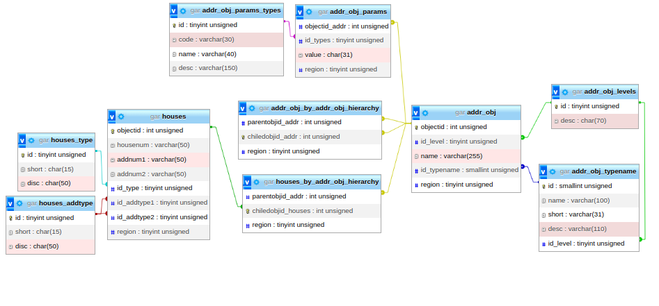
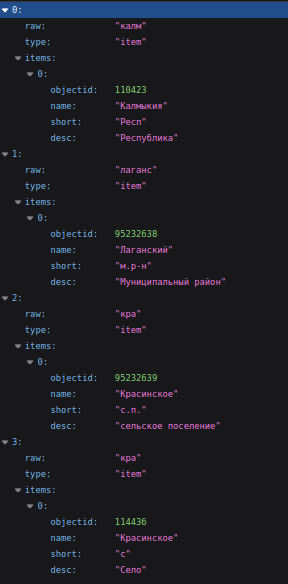
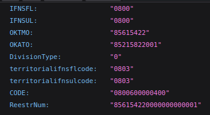

# Сервис верификации адресной информации на основе ГАР БД ФИАС
### Описание
Данный сервис включает в себя: 
- Средства для создания и организации локальной БД, используя исходники ГАР БД ФИАС;
- Реализацию простого RESTful-сервиса, осуществляющего верификацию пользовательских адресных данных или получения специальных кодов.
### Конфигурирование проекта
Проект использует файл ".env" для получения глобальных конфигурационных переменных. 
Пример файла конфигурации представлен в файле "./env.example".

Используйте следующую команду перед настройкой проекта: 
```bash 
$ cp ./.env.example ./.env
```

Более "комплесные" настройки представленны в директории "./config/", в числе которых:
+ ***drivers/**** - основные шаблоны, согласно которым функционирует конструктор SQL-запросов;
+ ***migration.php*** - списки классов-моделей, которые подлежат миграции;
+ ***regions.php*** - список регионов, которые необходимо загрузить из исходников ГАР БД ФИАС;
+ ***xml_handlers_config.php*** - список обработчиков, осуществляющих парсинг xml-документов архива ГАР БД ФИАС;

Если вы используете сервис для загрузки данных из ГАР БД ФИАС в локальную БД, необходимо **разместить архив по пути ./resources/archive/gar_example.zip** или указать собственные пути в файле конфигурации .env!

### Взаимодействие с помощью командной строки
Для взаимодействия с сервисом используется следующий интерфейс:
```bash
$ ./gar <команда> [параметры] 
```
Основные наборы команд:
+ Получение справки по существующему функционалу:
```bash
$ ./gar help 
```
+ Миграция и загрузка данных в локальную БД:
```bash
$ ./gar upload -m 
```
+ Пересоздать текущую структуру базы данных и начать загрузку 8-го и 17-го региона, используя два потока:
```bash
$ ./gar upload --migrate-recreate -r 8,17 -t 2 
```
+ Запустить сервер в (зависимости от конфигурационного файла будет запущен встроенный тестовый сервер php или SWOOLE):
```bash
$ ./gar serve 
```

### Структура базы данных по умолчанию

На 08.10.22 производиться формаирование следующих таблиц:
+ Адресные объекты:
  + ***addr_obj*** - адресные объекты;
  + ***addr_obj_levels*** - категории адресных объектов по их уровням;
  + ***addr_obj_typenames*** - категории адресных объектов по типу (город, район, улица и т.п.);
  + ***addr_obj_params*** - таблица с описанием параметров для конкретного адресного объекта;
  + ***addr_obj_params_types*** - категории параметров адресных объектов;
  + ***addr_obj_by_addr_obj_hierarchy*** - иерархия адресных объектов в формате ~~master~~ "родитель" => "ребёнок"
+ Дома:
  + ***houses*** - дома;
  + ***houses_type*** - категории домов по их типу;
  + ***houses_addtype*** - дополнительные категории домов по их типу;
  + ***houses_by_addr_obj_hierarchy*** - карта домов, относящихся к конкретных адресных объектам;

### Демонстрационный REST API сервис
Демонстрационный сервис в проекте расчитан на работу с использованием фреймворка SWOOLE, но ничего не мешает Вам отключить эту опцию SWOOLE_SERVER_ENABLE в .env файле и использовать NGINX или APACHE через точку входа **./public/index.php**.

Ожидаемые запросы:
+ Разбор пользовательского адреса:
```
/<номер_региона>/address?address="..."
```
+ Получение кода (или всех кодов, используя тип "all") по конкретному OBJECTID или АДРЕСУ:
```
/<номер_региона>/code/<тип_кода>?address="..."  (по адресу)
/<номер_региона>/code/<тип_кода>?&objectid="..." (по objectid)
```

Пример запроса для получения верифицированного адреса из "калм,лаганс,кра,кра" в 8 регионе:
```
http://0.0.0.0:9501/08/address?address=калм,лаганс,кра,кра
```

Ответ:



Пример запроса для получения всех доступных кодов по аналогичному адресу:
```
http://0.0.0.0:9501/08/code/all?address=калм,лаганс,кра,кра
```

Формат JSON-ответа:


Аналогичный ответ можно получить, используя objectid последнего объекта:
```
http://0.0.0.0:9501/08/code/all?objectid=114436
```

### Заключение
Сервис всё ещё дорабатывается, данный readme скорее заглушка, но всё же это лучше чем голый репозиторий)